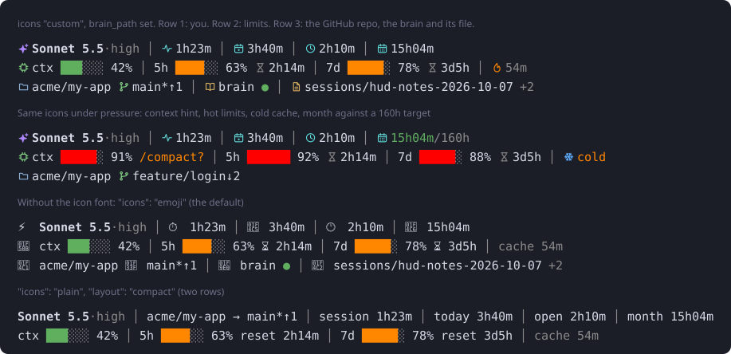
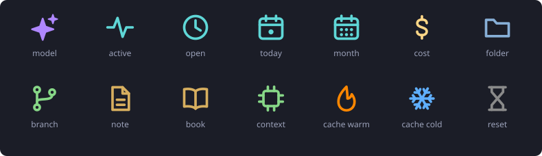

# claude-code-hud

A status line for [Claude Code](https://code.claude.com). Three themed rows that fit your terminal, or two if you are short on height. One Python file, standard library only, no network calls.



- **Row 1, you:** model and effort, active time, time today, how long the session has been open, time this month.
- **Row 2, limits:** context window, 5-hour and 7-day usage, prompt cache timer.
- **Row 3, place:** the GitHub repo you are working in (`owner/repo`) and its branch, the name of your notes folder (a "brain", wiki or docs vault) with a dot that is green when the folder exists, and the file in it that the session is working on.

Items are listed in priority order. When your terminal is narrow, the last ones drop off first. Short on height? Set `"layout": "compact"` for two rows.

## What it shows

Each segment has an icon, so there are no labels like "open" or "today" to read. The icons are in the next section.

| Segment | Shows |
| --- | --- |
| `model` | Model name, effort level (`high`, `xhi`, ...), `fast` when fast mode is on |
| `session` | Active time in this session |
| `elapsed` | How long the session has been open |
| `today` | Active time across all sessions today |
| `month` | Active time this month, with a `/160h` style target if you set one |
| `cost` | Session cost estimate in USD (list price, may differ from your bill) |
| `lines` | Lines added and removed this session |
| `name` | Session name, if you set one with `/rename` |
| `where` | The git project you are working in: `owner/repo` from the origin remote (GitHub, GitLab, Bitbucket or Codeberg), else the folder name. The folder is added in brackets when it is named differently. Then the branch, `*` if dirty, `↑2` ahead, `↓1` behind |
| `brain_name` | The name of your notes folder, with a green dot when it exists and a red circle when it is missing. Needs `brain_path` |
| `brain` | Newest file the session touched in your notes folder, plus `+N` for other recent files. Needs `brain_path`. Shortened to the room left on the row |
| `context` | Context window bar. Shows a hint once you pass 75% |
| `five_hour` | 5-hour usage bar and time until reset |
| `seven_day` | 7-day usage bar. Reset time appears once you pass 70% |
| `cache` | Time left on the prompt cache, or cold |

Bars turn orange at 60% and red at 85%. A segment hides itself when Claude Code does not send its data. Rate limits only exist for Pro and Max plans, so API users will not see those two bars.

Default rows: `model session today elapsed month` / `context five_hour seven_day cache` / `where brain_name brain`. `cost`, `lines` and `name` are off until you add them to a row.

## Icons



A terminal cannot draw SVG, so these 14 icons ship twice: as SVG files in [`icons/svg/`](icons/svg) and as glyphs in a small icon font, [`fonts/ClaudeHudIcons.ttf`](fonts/ClaudeHudIcons.ttf). Both come from one drawing, [`icons/design.py`](icons/design.py). The font puts each icon on a private-use code point, so your terminal draws it as text and colours it like text.

Three icon sets, chosen with `"icons"`:

| Set | Looks like | Needs |
| --- | --- | --- |
| `custom` | The icons above, each in its own colour | The icon font installed, see below |
| `emoji` | Emoji. This is the default | Nothing |
| `plain` | Text labels (`session`, `open`, `today`), no icons | Nothing |

### Install the icon font

```
python install.py --font
```

That copies the font into your user fonts (no admin rights), sets `"icons": "custom"` in your config, and prints the terminal step. Installing the font is not always enough: most terminals only draw the icons once the font is in their font list as a fallback.

- **Windows Terminal:** needs this. In `settings.json`, under `profiles` > `defaults`, add `"font": { "face": "Cascadia Mono, Claude HUD Icons" }` (a comma-separated list is a fallback list). Windows Terminal reloads the file when you save it.
- **VS Code:** `"terminal.integrated.fontFamily": "'Cascadia Mono', 'Claude HUD Icons'"`
- **Other terminals:** use whatever your terminal calls a fallback or symbols font. The font only contains the 14 icons, so it never replaces your main font.

Each icon is followed by a space in the HUD, because the glyphs are a little wider than one terminal cell.

To remove it, delete `ClaudeHudIcons.ttf` from your user fonts folder and set `"icons": "emoji"`.

## Install

You need Python 3.9 or newer. `git` is optional and only used for the branch.

```
git clone https://github.com/BrucePelser/claude-code-hud.git
cd claude-code-hud
python install.py --backfill
```

The installer copies `hud.py` into `~/.claude/hud/`, writes a starter `~/.claude/hud.config.json`, and sets `statusLine` in `~/.claude/settings.json`. It backs up `settings.json` first and refuses to replace a different status line unless you pass `--force`. Open a new Claude Code session to see it.

Options:

- `--backfill` reads this month's existing transcripts once, so `month` starts out right instead of at zero
- `--font` installs the icon font for your user and switches to the `custom` icon set
- `--config-dir PATH` for a non-default config folder (it also honours `CLAUDE_CONFIG_DIR`)
- `--python python3` if `python` on your PATH is not the one you want
- `--refresh 15` seconds between refreshes
- `--uninstall` removes the `statusLine` entry

Preview without installing: `python hud.py --demo`

### Manual install

Copy `hud.py` anywhere and add this to `settings.json`:

```json
{
  "statusLine": {
    "type": "command",
    "command": "python /path/to/hud.py",
    "refreshInterval": 15
  }
}
```

`refreshInterval` is in seconds. The cache countdown and reset timers only move when the HUD runs, so keep it low. Each run takes about 0.2 seconds.

## Configure

Edit `~/.claude/hud.config.json`. Every key is optional. Set `CLAUDE_HUD_CONFIG` to point at a different file. [`hud.config.example.json`](hud.config.example.json) lists all defaults.

| Key | Default | Meaning |
| --- | --- | --- |
| `icons` | `"emoji"` | `"custom"` (needs the icon font), `"emoji"` or `"plain"` |
| `layout` | `"rows"` | `"rows"` is three themed rows: you, limits, then the repo and brain. `"compact"` is two rows, with the project on row 1 and the brain file on row 2 |
| `line1`, `line2`, `line3` | from the layout | Segment names in order. A list here replaces that row. Put what matters most first |
| `max_width` | `"auto"` | Row width limit. `"auto"` uses your terminal width (Claude Code sets `COLUMNS`) minus 4, or 100 if it is not set. A number fixes it. A segment that would pass the limit is skipped, last ones first |
| `brain_path` | `null` | Folder to track, e.g. `"~/brain"`. Turns on the `brain` segment |
| `brain_max_len` | `44` | Longest brain label. Long paths keep the top folder and the file name |
| `brain_window_kb` | `4096` | How much recent transcript to scan for brain files |
| `monthly_target_hours` | `null` | Adds `/160h` to `month` and colours it by progress |
| `bar_width` | `6` | Cells per bar |
| `context_hint_at` | `75` | Percent where the context hint appears |
| `context_hint` | `"/compact?"` | Hint text. Empty string turns it off |
| `week_reset_above` | `70` | Percent where the 7d reset time appears |
| `idle_cap_minutes` | `10` | Longest gap that counts as active time |
| `git` | `true` | Set `false` to skip the git call |
| `colors` | | xterm 256 codes for `ok`, `warn`, `bad`, `dim`, `add`, `del` |
| `icon_colors` | | xterm 256 codes for the `custom` icons: `model`, `time`, `cost`, `folder`, `branch`, `brain`, `context`, `cache_warm`, `cache_cold`, `dim` |
| `thresholds` | `60`, `85` | Percent where bars go orange and red |

`NO_COLOR=1` turns colour off.

Example, a compact HUD with cost, no icons, and only two rows:

```json
{
  "icons": "plain",
  "line1": ["model", "cost", "session", "where"],
  "line2": ["context", "five_hour", "cache"],
  "line3": []
}
```

## How the numbers work

**Active time** is the sum of the gaps between message timestamps in the session transcript, with each gap capped at 10 minutes. Leave a session open overnight and it still reads a few minutes, not 12 hours. It is an estimate of time spent working, not a billing record.

**Open time** is the session's own wall-clock figure from Claude Code. It leaves out the time a session was closed, so a resumed session does not read as days. Active time is usually the smaller number: open time includes the minutes you spent away.

**Project** answers "where am I working". Sessions often start in your home folder, which tells you nothing, so the HUD looks for the git repository of the working folder first, then of the newest file a tool call touched in the last 4 MB of the transcript. Your notes folder, the Claude config folder and scratch folders never count as the project. If there is no repository, a working folder other than home is shown by name, and a home folder shows nothing. Work done by subagents is written to separate transcripts, so it does not show up here. The `owner/repo` name comes from `git remote get-url origin` (read every 5 minutes). Any username or token inside a remote URL is stripped before anything is shown.

**Brain** looks at the same tool calls (reads, edits, writes, shell commands) and keeps any path under `brain_path`. The newest file is shown, and a folder named in a command only counts when no file was touched. Search results and file listings do not count, only paths Claude actually used. If no file has been touched yet but the session started inside `brain_path`, it shows that folder instead.

**Today and month** come from per-day totals the HUD keeps in `<config dir>/hud-state/active.json`, updated each time it runs. Each Claude config directory gets its own file, so two accounts stay separate. Entries older than 70 days are dropped. Run `python hud.py --backfill` any time to rescan this month's transcripts.

**Cache** is the prompt cache timer from Claude Code. After it hits zero, your next prompt re-reads the whole context at full price. That is the moment to know about before you walk away from a long session.

## Privacy

Nothing leaves your machine. The HUD makes no network calls. It reads the JSON Claude Code gives it, your local session transcripts (timestamps only, message text is never stored), and runs `git status` and `git remote get-url origin` in your project folder. It writes small files to `<config dir>/hud-state/`: the per-day time totals, a 5-second git cache, and a cache of the file paths found in your transcripts' tool calls (used for the project and brain items). Delete that folder to reset.

## Troubleshooting

- **Nothing shows.** Run `python hud.py --demo`. If that works, check the `command` path in `settings.json`. Set `CLAUDE_HUD_DEBUG=1` in the environment to see errors instead of a bare model name.
- **Line wraps in a narrow pane.** With `max_width` on `"auto"` this should not happen. If your terminal does not pass `COLUMNS`, set a number.
- **A segment is missing.** It did not fit the row width. Widen the pane or move that segment to a row with room. The `"rows"` layout has the most room; `"compact"` has the least.
- **The repo shows the folder name, not `owner/repo`.** The repository has no `origin` remote, or the remote is not on GitHub, GitLab, Bitbucket or Codeberg. A path on a private server is not shown as a repo name.
- **The project shows nothing.** The session is in your home folder and no tool call has touched a file inside a git repository yet. It appears as soon as one does.
- **No brain segment.** Set `brain_path` and use a file in it. Only the last 4 MB of transcript is scanned, so a brain file touched long ago drops off.
- **Icons show as empty boxes, or a diamond with a question mark.** The terminal does not have the icon font in its font list. See "Install the icon font", or set `"icons": "emoji"`.
- **Emoji look misaligned.** Set `"icons": "plain"` or install the icon font.
- **No `cache` segment.** It needs Claude Code 2.1.251 or newer.
- **`today` and `month` start at zero.** Run `python hud.py --backfill`, or reinstall with `--backfill`.
- **Windows: `python` not found.** Reinstall with `--python py` or the full path to your interpreter.

## Develop

```
python -m unittest discover -s tests -v
python scripts/render_preview.py     # rebuilds assets/preview.svg from real output
```

To change an icon, edit its drawing in `icons/design.py`, then rebuild the SVGs and the font. This needs `pip install fonttools shapely`, which nothing else does:

```
python scripts/build_icons.py
python scripts/render_preview.py
```

If you add an icon, also add its code point to `GLYPHS` in `hud.py`. A test fails until the two match.

## License

MIT. See [LICENSE](LICENSE).
